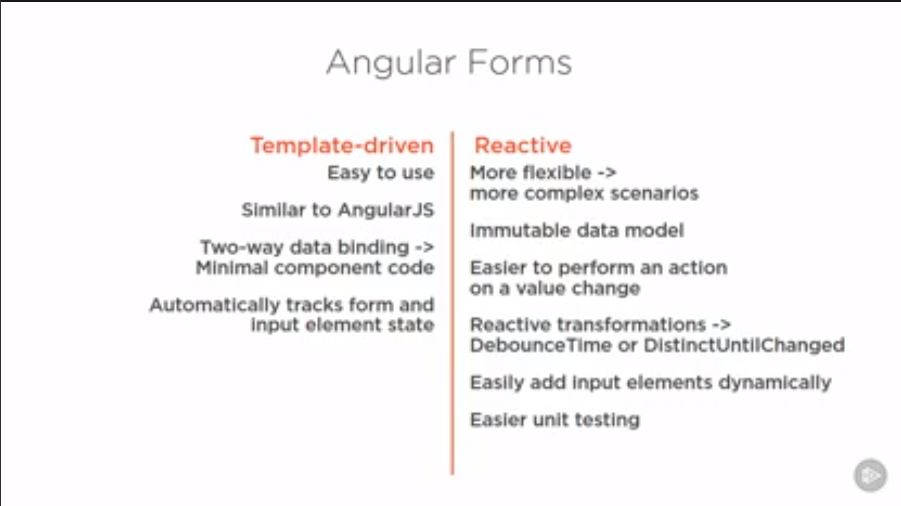
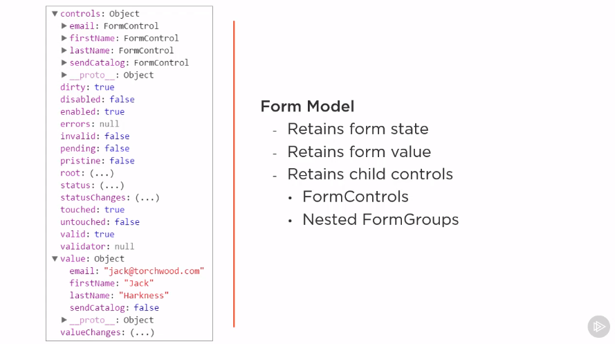
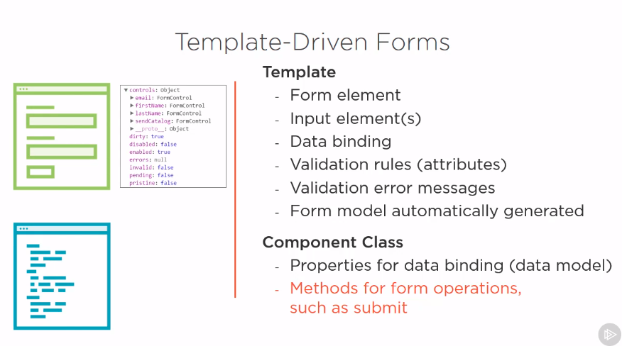
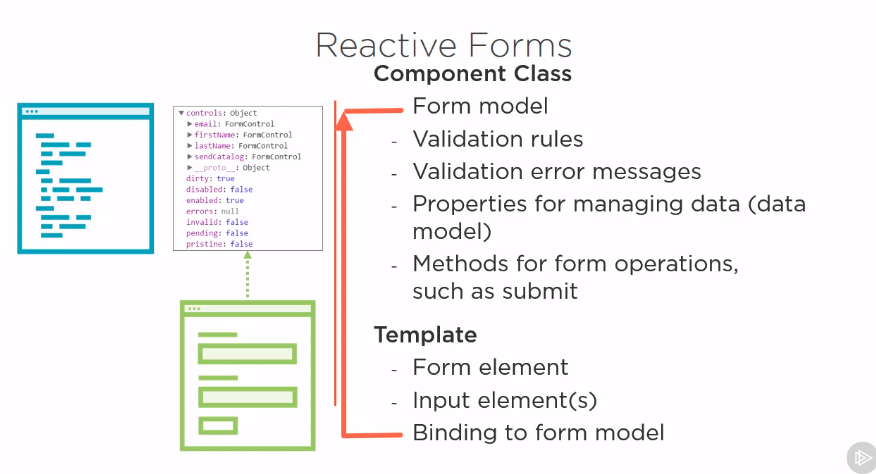
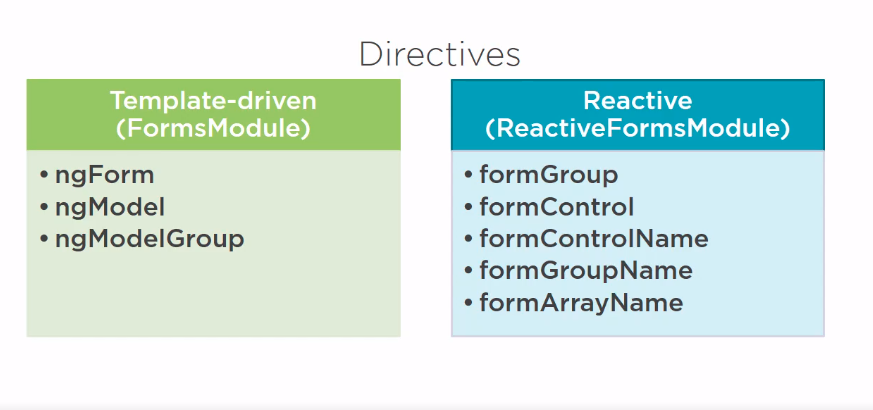

# Forms
Two types of forms in Angular.
* Template-driven
* Reactive forms

## Angular Reactive Forms

### State
#### Value Changed
1. If all the elements in the form is pristine then the form is pristine.
2. If any-one of the elements in the form is dirty then the form is dirty.

 * Pristine
 * dirty
 
#### Validity
##### 1. Valid 
 An Input element is valid if it passes all the defined validation rules. The form itself is valid if
 all the elements in the form are valid.
 
##### 2. Errors 
 Validation errors are added to the ***errorsCollection*** 
 The key of the each array element is the name of the validation rule associated with the error.
 
#### Visited
##### 1. Touched
Determines if the user has visited the input element and left.

##### 2. Untouched
if not set focus then left the input element.

### Form Building Blocks

* `FormControl` -  Tracks the valeu and state of an input element. Such as an input box.
* `FormGroup` - Tracks the value and state of groups of `FormControl`, `<form>` itself managed as `FormGroup`

#####Form Model:
A form model is the datastructure that represents the HTML form. The structure of the form model represents the structure of the form in a template.

Each elements in the form has a corresponding `FormControl` in the form model.

Retains form state - such as dirty, valid
Retains form value - when input element value is changed by user input, the value property for the corresponding input element changed accordingly.

###### Template-driven Forms

###### Reactive Forms

### Form Directives

